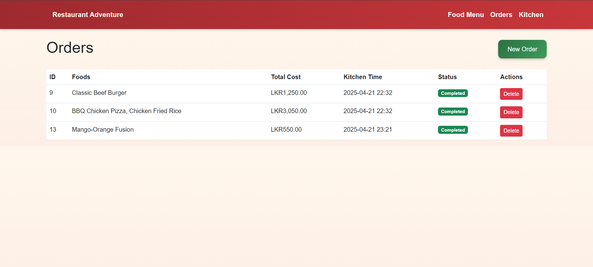

# 🍔 Restaurant Management System

Welcome to **Restaurant Management System** built with Laravel, MySQL, Bootstrap, and JavaScript! 🎉 This app helps you manage food items, create orders, and send them to the kitchen with a modern, interactive design. Perfect for running a restaurant smoothly! 🚀

## ✨ Cool Features
- 🍕 **Food Menu**: Add, edit, or delete food items with pictures and prices.
- 🛒 **Orders**: Create orders, add quantities (like 3 Burgers!), and schedule when they go to the kitchen.
- 🍳 **Kitchen**: See orders in the kitchen and mark them "Done" with a confetti party! 🎊
- 🎨 **Fun Design**: Hover effects, colorful prices, and a cheerful UI!

## 🛠️ How to Set Up
Let’s get this app running on your computer! You’ll need **PHP (>= 8.1)**, **Composer**, **MySQL**, **Node.js**, **NPM**, and **Git**.

1. **Clone the Project**  
   Download the app from GitHub:
   ```bash
   git clone https://github.com/ManulBandara/restaurant-management-assignment.git
   cd restaurant-management

2. **Install the Goodies Set up the backend and frontend**
    composer install
    npm install
    npm run dev

3. **Set Up the Environment Copy the config file and add your database details:**
change .env to this

DB_CONNECTION=mysql
DB_HOST=127.0.0.1
DB_PORT=3306
DB_DATABASE=restaurant
DB_USERNAME=root
DB_PASSWORD=

QUEUE_CONNECTION=sync

4. **Generate a key for Laravel:**
php artisan key:generate

5. **Create the Database Make a new database in MySQL:**

mysql -u root -p
CREATE DATABASE restaurant;
EXIT;

6. **Database name "restaurant" and import the .sql file to it**
Import restaurant.sql file 

7. **Link Images To make uploaded images work, run:**
php artisan storage:link

8. **Start the App**
php artisan serve

Then open your browser and visit:
🌐 http://localhost:8000

## 📸 Screenshots

#


#


#


#

---

## 🧑‍💻 Author

- **Manul Bandara**
- GitHub: [ManulBandara](https://github.com/ManulBandara)

